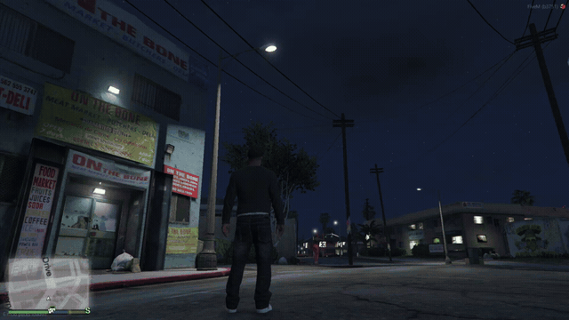
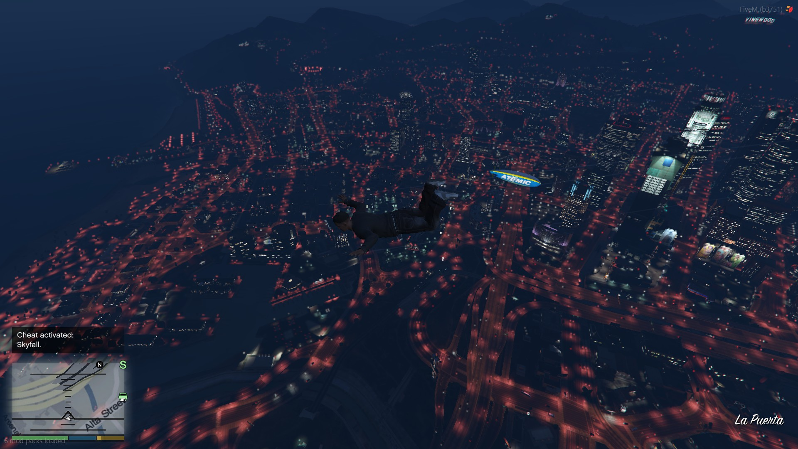
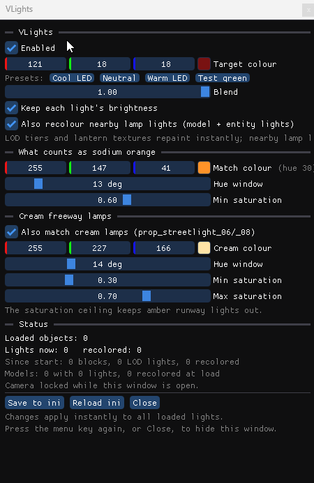

# VLights

A FiveM plugin that turns the orange sodium street lights of Los Santos
into any colour you like. Cool white, warm LED, or whatever you set. It
works on everything you can see: the distant glow across the city, the
lamps along the road, the light they cast on the ground, and the glowing
lantern heads themselves.

Client-side only and purely cosmetic. It changes colours in your own game
as the world streams in and touches nothing else. Story mode and servers
that allow plugins both work.



The whole city follows, right out to the horizon. Here with the target set
to red for effect:



## Install

1. Download `VLights.asi` from the
   [Releases page](https://github.com/tcpstorm/vlights/releases) (or
   build it, see below).
2. Put it in `FiveM.app\plugins\`. Create the folder if it does not exist.
   On most installs that is `%LOCALAPPDATA%\FiveM\FiveM.app\plugins`.
3. Start FiveM. The plugin writes its settings file
   (`vlights.ini`) and a log next to itself on first run.

That's it. Street lights are white the next time you load into the world.

**Servers.** A server decides whether plugins load. Anything with
`sv_pureLevel` below 2 allows them; you can see the value under `vars` at
`http://<server>:30120/info.json`. Whether a server's *rules* allow a
cosmetic plugin is your call, not the plugin's.

## Use

Press **F10** in-game for the menu. It floats over the game as its own
small window; the camera is locked while it is open so the mouse does not
move your view.



- **Target colour** with presets: cool LED, neutral, warm LED, and a
  bright green for checking coverage.
- **Blend** between the original colour and the target, and **keep each
  light's brightness** so dim lamps stay dim.
- **Match settings** if a lamp is being missed or a light you want kept
  is being caught. The defaults cover every sodium and cream street lamp
  in vanilla Los Santos and leave car indicators, signage, runway lights
  and traffic lights alone.
- **Save** writes the ini; **Reload** re-reads it.

Press **F9** to re-read the ini without the menu. Both keys can be changed
in the ini.

The menu also tells you when a newer release is out, with a button to the
Releases page. That's the only network access the plugin has: one request
to GitHub at startup, off with `update_check = 0`, and it never installs
anything on its own.

**What updates instantly and what doesn't.** Far-away lights and the
lantern glow change the moment you touch a setting. The lights that lamps
near you cast on the ground change as those lamps stream back in: move a
few blocks away and return, or reload. That is how the game holds them;
see the docs if you want the why.

## Settings

All of these live in `vlights.ini` next to the plugin. The file
is commented; the essentials:

| Key | Default | What it does |
| --- | --- | --- |
| `enabled` | `1` | Master switch. `0` puts everything back. |
| `target` | `235 240 255` | The colour lamps become. `R G B` or `#RRGGBB`. |
| `blend` | `1.0` | 1 = the target colour, 0.5 = halfway, 0 = untouched. |
| `keep_brightness` | `1` | Each lamp keeps its own brightness. |
| `hue_window`, `min_saturation` | `13`, `0.6` | How far from sodium orange a light may be and still count. |
| `match_cream` and the `*2` keys | on | A second zone for the cream-coloured freeway lamps. |
| `match_cool` and the `*3` keys | on | A third zone for the teal-white lamp variant. |
| `all_streetlights` | `1` | Every light on a street-lamp model takes the target colour, whatever it was: white, teal, pale blue variants included. `0` = only sodium, cream and teal colours. |
| `near_enabled` | `1` | Also recolour the lamps near you (needs a restart to change). |
| `textures` | `1` | Also recolour the glowing lantern heads. |
| `texture_names` | `streetlight, wall_light, ...` | Which textures count as lamps, by name. |
| `texture_force` | `prop_streetlight_01_bulb` | Lens textures retinted entirely, for variants whose tint is too faint to match. |
| `reload_key`, `menu_key` | `F9`, `F10` | Hotkeys. `0` disables one. |
| `update_check` | `1` | Once at startup, ask GitHub whether a newer release exists and say so in the menu. Nothing is downloaded or installed. `0` = never contact anything. |
| `debug` | `0` | Detailed logging for troubleshooting. Leave off; it costs frames. |

## Something still orange?

Set `debug = 1` and `near_log = 1`, restart, walk to the lamp, press F9,
and read `vlights.log` next to the plugin. It names every lamp
it saw, every colour it did not match, and every texture it changed.
`docs/diagnostics.md` explains the lines, and each of the other documents
in `docs/` ends with a procedure for its kind of light. Set `debug` back
to `0` afterwards.

## Build it yourself

Only Docker Desktop is needed; nothing else gets installed.

```powershell
.\build.ps1            # -> .\dist\VLights.asi
.\build.ps1 -Install   # also copies it into the FiveM plugins folder
```

Details, source layout, and how every fact the plugin relies on was
verified are in `docs/development.md`. Versioning, releases, and the rules
for changes to game hooks are in `CONTRIBUTING.md`.

## Docs

`docs/` holds the reference material: how each kind of light works and is
hooked, the FiveM and engine behaviour that shaped the design, the
diagnostics, and the development notes. Start at `docs/README.md`.

## Licence

MIT, see `LICENSE`. Bundles MinHook (BSD 2-Clause) and Dear ImGui (MIT)
under `third_party/`.
